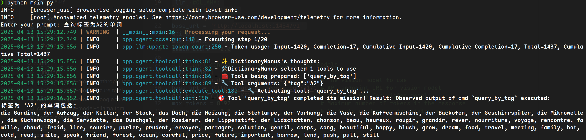
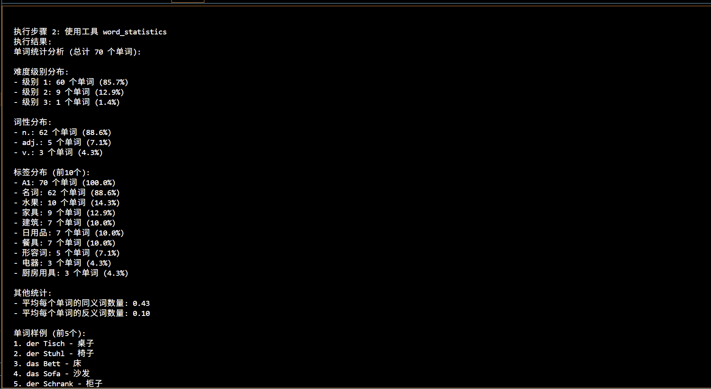
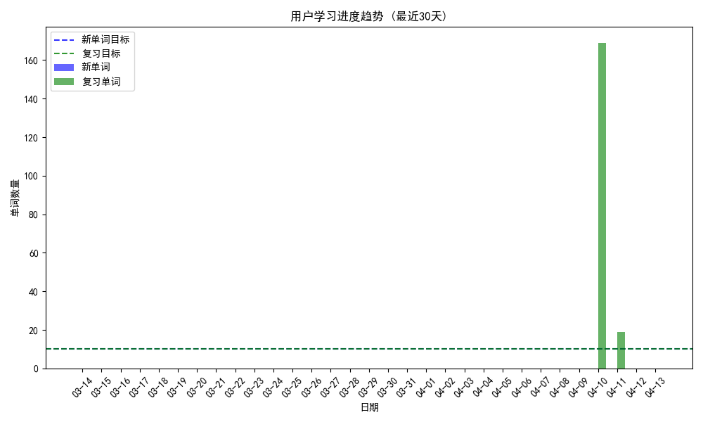

## 问题一
### 1. 如何在该框架下，能够访问本地数据库
要在OpenManus框架下访问本地数据库，需要遵循以下步骤：
1. **创建数据库连接函数**：封装数据库连接逻辑，处理连接配置
2. **实现BaseTool子类**：创建继承自BaseTool的工具类，定义工具的名称、描述和参数
3. **实现execute方法**：在execute方法中编写数据库查询和结果处理逻辑
4. **返回标准结果**：使用ToolResult返回查询结果或错误信息
5. **提供资源清理**：实现资源清理方法，确保数据库连接正确关闭
### 2. 如何设计该Function？它的输入输入应该是什么？
设计数据库访问功能时，应考虑以下几个方面：
#### 输入设计
- **参数定义**：使用JSON Schema格式在parameters属性中定义参数
- **必要参数**：明确标记必要参数
- **参数描述**：为每个参数提供详细描述
#### 输出设计
- **结构化输出**：使用ToolResult返回结构化结果
- **错误处理**：通过try/except捕获异常，提供清晰的错误消息
- **格式化输出**：按照一致的格式构造输出字符串
#### 功能设计
- **单一职责**：每个工具类应专注于一个特定的数据库访问功能
- **复用连接**：共享数据库连接逻辑以提高效率
- **安全性考虑**：防止SQL注入和保护敏感数据
### 3. 请实现该Function
#### 数据库系统介绍
本案例中将OpenManus与用MongoDB存储的德语数据库连接，实现查询单词详情、按标签查询单词、查询单词的同反义词等。源代码见`app/tool/word_dict_tools.py`和`app/agent/dict_manus.py`
#### 建立数据库连接

```python
def get_mongo_collection():
    uri = (
        f"mongodb://{username}:{password}@{host}:{port}/{database}?authSource={auth_db}"
    )
    client = MongoClient(uri)
    db = client[database]
    collection = db["words"]
    return collection
```
#### 从`BaseTool`继承工具类(按标签查询为例)
```python
class WordByTagTool(BaseTool):
    name: str = "query_by_tag"
    description: str = "根据标签查询所有单词，例如 A2、名词、建筑等"

    parameters: Dict[str, Any] = {
        "type": "object",
        "properties": {"tag": {"type": "string", "description": "标签名，例如 '建筑'"}},
        "required": ["tag"],
    }

    async def execute(self, **kwargs) -> ToolResult:
        tag = kwargs.get("tag", "")
        try:
            coll = get_mongo_collection()
            cursor = coll.find({"tags": tag}, {"word": 1})
            words = [doc["word"] for doc in cursor]

            if not words:
                return ToolResult(output=f"没有找到标签为 '{tag}' 的单词")

            return ToolResult(
                output=f"标签为 '{tag}' 的单词包括：\n" + ", ".join(words)
            )
        except Exception as e:
            raise ToolError(str(e))
```
#### 实现工具集合
``` python
class DictionaryTools:
    """德语词典工具集合"""

    @staticmethod
    def get_tools() -> ToolCollection:
        """获取所有词典工具"""
        return ToolCollection(WordDetailTool(), WordByTagTool(), WordSynAntTool())

    @staticmethod
    async def cleanup():
        """清理资源"""
        await cleanup_mongo_connections()
```
#### 自定义单词查询agent
```python 
class DictionaryManus(Manus):
    """带有德语词典功能的 Manus 代理"""
    name: str = "DictionaryManus"
    description: str = "Manus agent with German dictionary capabilities"
    available_tools: ToolCollection = Field(
        default_factory=lambda: ToolCollection(
            PythonExecute(),
            BrowserUseTool(),
            StrReplaceEditor(),
            Terminate(),
            WordDetailTool(),
            WordByTagTool(),
            WordSynAntTool(),
        )
    )
    system_prompt: str = """你是 DictionaryManus，一个具有德语词典功能的多功能代理。
你可以使用以下工具来帮助用户学习德语：
1. word_detail: 查询单词的详细信息，包括定义、发音、词性等
2. query_by_tag: 根据标签查询所有单词，例如 A2、名词、建筑等
3. syn_ant_query: 查询单词的同义词和反义词
当用户需要查询德语单词时，请优先使用这些专门的词典工具。
"""
    async def cleanup(self):
        """清理代理资源"""
        await super().cleanup()
        from app.tool.word_dict_tools import cleanup_mongo_connections
        await cleanup_mongo_connections()
```
#### 查询结果示例


## 问题四

### 1. OpenManus中，Next Plan是怎么获得的，对应的输入和输出分别是什么？请举例说明

#### Next Plan 实现说明

##### Next Plan的基本概念

在OpenManus框架中，Next Plan是在执行Initial Plan后，根据执行结果和当前状态动态生成的后续计划。它允许代理根据前一步执行的结果来调整后续的行动，实现更灵活、智能的任务执行流程。

##### Next Plan的输入和输出

**输入：**

- 用户的原始查询/目标
- 已执行步骤的详细信息和结果（执行历史）
- 当前任务的上下文和状态
- 可用的函数/工具列表

**输出：**

- 包含推理过程的说明
- 下一步操作的详细计划（包括要调用的函数及其参数）
- 可能的后续步骤预计

##### Next Plan的获取流程

1. 系统执行完当前计划的一步后，收集执行结果和当前状态
2. 构建包含执行历史、当前状态和可用工具的提示信息
3. 调用大语言模型(LLM)来分析当前情况并决定下一步行动
4. 解析LLM返回的JSON格式计划
5. 执行新计划，然后重复此过程

##### 代码实现细节

我们在`EnhancedManus`类中实现了Next Plan功能：

- `get_next_plan()`: 核心方法，负责基于执行历史和当前状态生成下一步计划
- `run_with_next_plan()`: 使用Next Plan功能执行完整的用户请求
- `_extract_json_object()`: 辅助方法，从LLM响应中提取JSON格式的计划
- `execute_step()`: 执行单个步骤并收集结果

### 2. 请修改OpenManus代码，实现完整的本地数据分析功能

#### 本地数据分析功能实现

##### 数据模型理解

我们的系统基于一个学习词汇的应用程序，包含以下主要集合：

- **words**: 存储单词信息，包括词性、定义、难度等
- **word_learning_progress**: 记录用户的单词学习进度
- **learning_records**: 记录用户的学习活动
- **learning_goals**: 存储用户设定的

- **user_wordbooks**: 用户创建的词书集合
- **system_wordbooks**: 系统预设的词书集合
- **posts**: 用户发布的学习帖子

这些集合之间通过用户ID和单词ID建立关联，形成一个完整的单词学习系统。

##### 分析工具设计

针对上述数据模型，我们设计了6个主要分析工具：

1. **CollectionBasicInfoTool**: 提供数据库集合的基础统计信息，包括文档数量、大小等。
   - 输入：无需参数
   - 输出：所有集合的统计信息
2. **WordStatisticsTool**: 分析单词集合的特征分布。
   - 输入：language（可选）, tag（可选）
   - 输出：难度分布、词性分布、标签分布等统计信息
3. **LearningProgressAnalysisTool**: 分析用户的学习进度。
   - 输入：user_id, period（可选）
   - 输出：熟练度分布、复习阶段分布、记忆效果分析等
4. **UserLearningGoalsTool**: 分析用户的目标完成情况。
   - 输入：user_id, days（可选）
   - 输出：目标设置、完成率、每日详情等
5. **WordbookAnalysisTool**: 分析词书内容和使用情况。
   - 输入：wordbook_id, is_system（可选）
   - 输出：词书内容分析、单词分布等
6. **LearningVisualizationTool**: 生成学习数据可视化图表。
   - 输入：user_id, chart_type, days（可选）
   - 输出：生成的图表路径和描述

##### 技术实现细节

###### 数据访问层

我们使用MongoDB作为数据存储，通过PyMongo库访问数据：

```python
def get_mongo_connection():
    """获取MongoDB连接"""
    if username and password:
        uri = f"mongodb://{username}:{password}@{host}:{port}/{database}?authSource={auth_db}"
    else:
        uri = f"mongodb://{host}:{port}/{database}"
    client = MongoClient(uri)
    return client
```

每个工具都通过这个连接访问相应的集合，执行查询和聚合操作。

###### 数据分析逻辑

数据分析主要包括以下几类操作：

1. **基础统计分析**：计算数量、平均值、分布等
2. **分组聚合分析**：按特定字段（如难度、标签）分组统计
3. **时间序列分析**：分析随时间变化的学习数据
4. **关联分析**：分析不同集合间的数据关系（如单词与学习进度）

###### 可视化实现

使用matplotlib和seaborn库实现数据可视化：

```python
def create_visualization(chart_type, data, options):
    plt.figure(figsize=(10, 6))
    
    if chart_type == "progress_trend":
        # 绘制学习进度趋势图
        plt.bar(x, data["new_words"], width=0.4, label='新单词', color='blue')
        plt.bar([i + 0.4 for i in x], data["review_words"], width=0.4, label='复习单词', color='green')
    
    elif chart_type == "proficiency_distribution":
        # 绘制熟练度分布饼图
        plt.pie(data["proficiency_counts"], labels=data["proficiency_labels"], autopct='%1.1f%%')
        
    # ...更多图表类型...
    
    plt.title(options["title"])
    plt.tight_layout()
    plt.savefig(options["output_path"])
    plt.close()
```

#### 系统集成

##### BiEnhancedManus代理

我们创建了一个特殊的代理类`BiEnhancedManus`，它结合了两个主要功能：

1. 从`EnhancedManus`继承Next Plan能力，实现智能规划执行
2. 集成了BI分析工具，提供数据分析能力

这样，代理可以根据用户的需求，动态规划分析步骤，并在每一步执行后根据结果调整后续计划。

##### 执行流程

完整的执行流程如下：

1. 用户输入分析需求
2. 代理生成初始计划并执行第一步
3. 代理分析执行结果，生成Next Plan
4. 执行Next Plan中的步骤
5. 重复步骤3-4，直到任务完成或达到最大步骤数
6. 返回最终分析结果和洞察

##### 示例场景

**场景1: 分析德语A1级单词**

```
用户: 分析所有德语A1级别的单词，它们的词性分布如何？
```

执行流程：

1. 首先使用`collection_basic_info`了解数据库结构
2. 然后使用`word_statistics`工具，传入参数`language="de", tag="A1"`
3. 分析结果，生成额外的洞察
4. 可能使用`learning_visualization`生成词性分布图表



**场景2: 分析用户学习进度**

```
用户: 分析用户"ed62add4-bf40-4246-b7ab-2555015b383b"的学习情况，他的目标完成度如何？
```

执行流程：

1. 使用`user_learning_goals`工具分析用户的目标设置和完成情况
2. 使用`learning_progress_analysis`分析用户的学习进度
3. 结合结果，提供关于用户学习情况的综合分析
4. 可能使用`learning_visualization`生成学习趋势图表



#### 优化与扩展

##### 性能优化

对于大型数据集，我们实现了以下优化：

1. **查询优化**：使用MongoDB的聚合管道在数据库层面完成计算
2. **数据采样**：对于统计分析，使用采样减少处理数据量
3. **结果缓存**：对于频繁查询的结果进行缓存

##### 可能的扩展方向

1. **预测分析**：添加基于历史数据的学习效果预测
2. **推荐系统**：根据学习数据推荐合适的单词和学习计划
3. **自定义分析**：允许用户定义自己的分析指标和可视化
4. **批量报告**：生成综合性的学习报告文档
5. **实时分析**：增加实时数据处理和分析能力

####  总结

本项目成功实现了OpenManus框架的Next Plan功能增强，并基于此开发了一套完整的本地数据分析系统。系统可以根据用户需求动态规划分析步骤，智能调整执行流程，提供深入的数据分析和可视化。

通过将AI代理技术与BI分析能力结合，我们实现了一个智能化的分析助手，不仅能够执行预定义的分析任务，还能理解用户需求、自主规划分析流程，并提供有价值的洞察。

这种结合为传统BI工具带来了新的可能性，使数据分析更加智能化、个性化和对话式，未来可以进一步扩展到更广泛的商业智能领域。

## 问题五

### 1. 在AI结合BI的应用场景中，对OpenManus的四大组件：Plan/Execution/Iteration/Outputs分别提出了哪些新的要求？
#### Plan 组件新要求
##### 业务理解能力
- **领域知识集成**：需要理解特定行业术语、KPI 定义和分析框架
- **业务目标导向**：计划必须与商业目标明确关联，而非仅关注技术实现
- **多级分析规划**：支持从概览到深入的多层次分析计划
##### 数据感知能力
- **数据可用性评估**：评估所需数据是否可用，以及数据质量如何
- **数据源选择**：智能选择最适合特定分析的数据源和BI系统
- **参数敏感度**：了解不同参数选择对分析结果的影响程度
##### 合规性与安全性
- **数据访问权限识别**：计划需考虑数据访问限制和用户权限
- **敏感数据处理**：识别并特殊处理敏感业务数据
- **合规性检查**：确保分析计划符合组织的数据治理规定
#### Execution 组件新要求
##### BI系统集成能力
- **多平台连接**：支持同时连接多个BI平台（Tableau、PowerBI、QlikView等）
- **复杂查询构建**：能够构建和优化复杂的BI查询
- **状态管理**：维护与BI系统的长连接和会话状态
##### 性能优化
- **增量加载**：支持大数据集的增量处理
- **并行执行**：并行执行独立的BI查询以提高效率
- **资源限制管理**：根据查询复杂度动态分配资源
##### 错误恢复能力
- **优雅降级**：当首选BI系统不可用时切换到备选系统
- **部分失败处理**：在部分查询失败时能够继续执行计划的其他部分
- **环境特定错误处理**：针对各种BI平台的特定错误提供专门处理
#### Iteration 组件新要求
##### 分析深度调整

- **动态深度控制**：根据初始结果动态决定后续分析的深度
- **异常情况深入**：检测到异常数据时自动深入分析
- **业务重要性评估**：根据业务价值判断是否需要进一步迭代
##### 假设验证循环
- **假设生成与验证**：生成业务假设并设计验证步骤
- **对比分析迭代**：支持多种分析方法的比较性迭代
- **探索-确认循环**：从探索性分析到确认性分析的循环
##### 上下文记忆增强
- **业务上下文保留**：在迭代过程中维护业务概念和术语理解
- **分析历史追踪**：记录已尝试的分析路径和结果
- **用户偏好适应**：学习并适应用户的分析习惯和偏好
#### Outputs 组件新要求
##### 业务决策支持
- **行动建议生成**：不仅提供数据分析，还提供具体行动建议
- **风险与机会评估**：明确指出分析结果蕴含的风险和机会
- **影响评估**：评估不同决策选项的潜在业务影响
##### 多层次呈现
- **受众适应**：根据用户角色（高管、分析师、运营人员）调整输出详细度
- **摘要与细节平衡**：提供简明摘要和可访问的深入细节
- **多角度视图**：从不同业务视角展示同一分析结果
##### 专业可视化
- **符合BI标准**：生成符合企业BI可视化规范的图表
- **洞察标注**：在可视化中突出关键洞察和异常
- **叙事性可视化**：构建讲述数据故事的可视化序列
##### 商业报告生成
- **定制报告格式**：符合企业报告标准的格式化输出
- **多级标题结构**：使用业务相关的标题和小标题组织内容
- **执行摘要生成**：为决策者生成简明的执行摘要
### 2. 在AI结合BI的应用场景中，对OpenManus的四大组件：Plan/Execution/Iteration/Outputs分别存在哪些潜在的问题以及新的挑战？
#### Plan 组件的问题与挑战

##### 业务理解局限
- **行业特殊性理解不足**：难以准确把握特定行业的分析范式和商业语境
- **隐含需求识别困难**：业务用户常常无法精确表达分析需求，存在大量隐含假设
- **业务优先级判断挑战**：难以在复杂的业务指标间判断真正的优先级
##### 分析规划困境
- **分析路径爆炸**：可能的分析路径呈指数级增长，难以在合理时间内确定最优路径
- **资源需求估计困难**：难以准确预估复杂 BI 查询的资源消耗和时间开销
- **依赖关系复杂性**：多维分析间存在复杂依赖关系，难以规划最佳执行顺序
##### 动态适应挑战
- **目标漂移处理**：业务分析过程中，用户目标常常动态变化
- **环境变化适应**：BI 系统可用性和性能波动带来的不确定性
- **数据探索与确定性平衡**：难以平衡自由探索与直接回答确定性问题的需求
####  Execution 组件的问题与挑战
##### 技术整合障碍
- **异构系统集成复杂**：不同 BI 平台的 API 和数据模型差异巨大
- **认证机制多样性**：各 BI 系统采用不同认证方式，难以统一管理
- **版本兼容性问题**：BI 平台版本更新可能破坏现有集成
##### 性能瓶颈
- **大规模数据处理限制**：处理企业级数据量时面临内存和计算瓶颈
- **网络延迟影响**：远程 BI 系统查询受网络条件影响显著
- **资源竞争问题**：高并发场景下多个分析任务间的资源竞争
##### 运行时故障
- **部分响应处理困难**：某些 BI 查询可能只返回部分结果或超时
- **错误消息不标准**：不同 BI 系统的错误信息格式各异，难以统一解析
- **中间状态恢复挑战**：长时间运行的分析任务中断后难以恢复
#### Iteration 组件的问题与挑战
##### 分析深度判断
- **过度分析风险**：可能陷入无限细化分析而错失全局视角
- **分析价值评估难题**：难以准确判断进一步分析是否会产生足够价值
- **终止条件模糊**：缺乏明确的分析终止标准，可能导致资源浪费
##### 方向调整困境
- **确认偏误风险**：倾向于寻找支持初始假设的证据而忽视反例
- **分析路径锁定**：一旦选定分析路径，难以识别何时应切换方向
- **用户意图变化适应**：用户在分析过程中可能改变关注点，需要敏感识别
##### 学习与记忆挑战
- **上下文过载**：长时间交互积累的上下文信息可能超出处理能力
- **跨会话记忆限制**：缺乏有效机制在不同分析会话间传递洞察
- **知识累积困难**：难以将特定分析中获得的领域知识应用到后续分析
#### Outputs 组件的问题与挑战
##### 结果可信度问题
- **不确定性表达困难**：难以准确传达分析结果的可信度和局限性
- **结论过度简化风险**：复杂的分析可能被不当简化为过于武断的结论
- **误导性解读风险**：可能产生技术上正确但业务上误导的解读
##### 专业性差距
- **行业表达规范差异**：不同行业有特定的数据展示和解读规范
- **专业术语精确性**：使用领域术语时的精确度和专业性挑战
- **图表专业性不足**：生成的可视化可能不符合行业标准和最佳实践
##### 叙事与表达挑战
- **数据故事构建**：将分析转化为连贯且有说服力的业务叙事
- **关键洞察突出**：在大量分析结果中准确识别和突出真正关键的洞察
- **多维度平衡**：在简明性、完整性、专业性和可操作性之间取得平衡
##### 行动建议风险
- **责任边界模糊**：AI 提供的业务建议涉及责任归属问题
- **决策影响评估不足**：难以全面评估建议实施的潜在风险和连锁反应
- **场景特异性理解不足**：通用建议可能忽略特定组织环境的独特因素
### 3. 在AI结合BI的应用场景中，对OpenManus的可能的优化有哪些？
#### 架构优化
- **微服务化重构**：将 OpenManus 组件重构为微服务架构，提高扩展性
- **事件驱动模型**：采用事件驱动架构提高组件间通信效率
- **无服务器函数支持**：支持将分析任务部署为无服务器函数，优化资源利用
#### 协作增强
- **多代理协作框架**：支持多个专业化代理协同工作解决复杂分析任务
- **人机协作接口**：提供结构化接口，使人类分析师能与系统无缝协作
- **知识共享机制**：在不同分析会话和用户间安全共享分析洞察
#### 安全与合规
- **数据治理集成**：与企业数据治理框架深度集成
- **隐私保护分析**：实现差分隐私等技术，保护敏感业务数据
- **合规性自动检查**：自动验证分析过程符合行业法规和公司政策